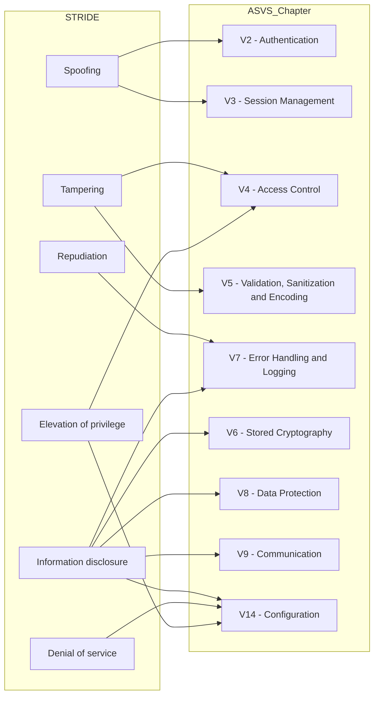

# 🖇️ STRIDE vs. ASVS

This [equivalence table](STRIDE-vs-ASVS-4.0.csv) bridges Threat Modeling with security control definitions by mapping the [STRIDE](https://en.wikipedia.org/wiki/STRIDE_(security)) model to the chapters of the [Application Security Verification Standard (ASVS)](https://owasp.org/www-project-application-security-verification-standard/).

👉 Check out the table here: [STRIDE-vs-ASVS-4.0.csv](STRIDE-vs-ASVS-4.0.csv)

Here’s a high-level diagram of the mapping:

### ⚠️ Disclaimer

This table is a convenient reference to help link these two resources. However, it does **NOT**:
1. Attempt to oversimplify the control selection process, as Security Requirement Engineering (SRE) is more complex and context-dependent.
2. Map all ASVS chapters, since the mapping to STRIDE isn’t always one to one due to:
   - Project-specific factors (e.g., *V12 - Files and Resources*).
   - Topics covered during the design phase (e.g., *V1 - Architecture & Design*).

## Table Format Overview

Here’s a quick rundown of the columns in the STRIDE vs. ASVS table:

1. **STRIDE**: the threat category being mapped.
2. **ASVS Chapter**: the ASVS chapter that addresses the identified threat.
3. **Teams**: the teams typically involved in implementing the control (indicative).
4. **Notes**: additional context or comments, if applicable.
5. **References**: the three reference columns are summarized as:
    | Short Name | Reference | Author | Description |
    |------------|-----------|--------|-------------|
    | RTMP       | [**HOWTO-Rapid Threat Model Prototyping** book](https://github.com/geoffrey-hill-tutamantic/rapid-threat-model-prototyping-docs/blob/master/18x26.Tutamen%20HOWTO-Rapid%20Threat%20Model%20Prototyping.pdf) | Geoffrey Hill, Tutamantic | Threat Modeling methodology |
    | STRIDE-OT10-CWE-OPC-ASVS | [**STRIDE-OT10-CWE-OPC-ASVS** excel](https://github.com/geoffrey-hill-tutamantic/rapid-threat-model-prototyping-docs/blob/master/19h20.mar.mapping%20table%20-%20STRIDE-OT10-CWE-OPC-ASVS.xlsx) | Mario Platt | Equivalence matrix between STRIDE and other standards |
    | ASVS        | [**Application Security Verification Standard v4.0.3**](https://github.com/OWASP/ASVS/tree/v4.0.3/4.0) | OWASP | Standard for testing web applications |

## Sample Workflow

Here’s a step-by-step guide to using this resource in the SRE process:

1. Understand the functional and technical requirements in their business context.
2. Apply Threat Modeling with STRIDE to identify threats.
    - The [RTMP methodology](https://github.com/geoffrey-hill-tutamantic/rapid-threat-model-prototyping-docs) is recommended for an agile-friendly approach.
3. Use the [STRIDE vs. ASVS](#equivalence-table) table to find which ASVS chapter addresses each threat.
4. Adapt the requirements to your project’s specific context.
    - Some controls may need modification, or may not apply.
5. Provide extra context using the [User Stories](https://en.wikipedia.org/wiki/User_story) format, following the [INVEST](https://en.wikipedia.org/wiki/INVEST_(mnemonic)) criteria.
    - Practical examples are available in the [project ASVS User Stories](https://github.com/OpenSecuritySummit/project-ASVS-User-Stories) by [@mario-platt](https://github.com/mario-platt).
6. Automate security controls where possible.
    - Level 1 controls are often easy to automate.
    - Check out the [OWASP ASVS 4.0 testing guide](https://github.com/BlazingWind/OWASP-ASVS-4.0-testing-guide) by [@BlazingWind](https://github.com/BlazingWind) for practical examples.
7. Track the completion of security requirements to manage residual risk.

## Rationale & Acknowledgement

This repository was inspired by [@mario-platt](https://github.com/mario-platt), who contributed to the Rapid Threat Modeling Prototyping (RTMP) repo with the [STRIDE-OT10-CWE-OPC-ASVS](https://github.com/geoffrey-hill-tutamantic/rapid-threat-model-prototyping-docs/blob/master/19h20.mar.mapping%20table%20-%20STRIDE-OT10-CWE-OPC-ASVS.xlsx) comparison table. This table maps STRIDE to ASVS, CWE, OWASP Proactive Controls, and OWASP Top 10.

This repository addresses key areas that needed improvement in the RTMP whitepaper, such as the additional step required to select the associated security controls (from OWASP Top 10 to ASVS).

However, the creation of this repo was driven by the following concerns:
1. The OWASP Top 10 reference is outdated (2017 version instead of 2021).
2. The ASVS reference is outdated (v3.0 instead of v4.0).
3. Minor disagreements with some of the proposed categorizations.

## TODO

- [ ] Identify additional references to support the categorization.
- [ ] Break down ASVS chapters into more specific sections.
- [ ] Create a [SecurityRAT](https://owasp.org/www-project-securityrat/) requirement set using this format.

[^1]: HOWTO-Rapid Threat Model Prototyping, page 17
